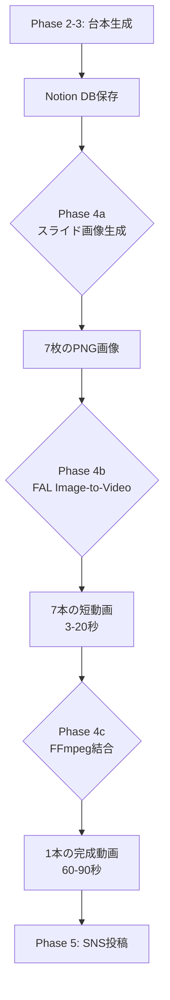

# WF7 Phase 4: FAL.ai実装 変更点定義書

**作成日**: 2025-11-06
**目的**: Creatomate→FAL.aiへの移行に伴うWF変更点の明確化

---

## 🔄 変更概要

### Before: Creatomate実装

```yaml
アーキテクチャ:
  Phase 2-3 → Notion DB → n8n HTTP Request → Creatomate API → 動画ファイル → Phase 5

特徴:
  - テンプレート編集方式
  - 1回のAPI呼び出しで完成動画
  - GUIでテンプレート編集可能

課題:
  - コスト高（月額 + レンダリング単価）
  - テンプレート探しに時間
  - カスタマイズの制約
```

### After: FAL.ai実装（ハイブリッド方式）

```yaml
アーキテクチャ:
  Phase 2-3 → Notion DB
    ↓
  Phase 4a → Pillowスライド生成 → 7枚の画像
    ↓
  Phase 4b → FAL Image-to-Video → 7本の動画（3-20秒）
    ↓
  Phase 4c → FFmpeg結合 → 1本の完成動画（60-90秒）
    ↓
  Phase 5 → SNS投稿

特徴:
  - 画像生成 + AI動画化 + 結合の3段階
  - テキスト配置の完全制御
  - 低コスト（70-80%削減）

利点:
  ✅ コスト効率が高い
  ✅ テキストの正確な配置
  ✅ 柔軟なデザイン変更
  ✅ 5部構成の厳密な実装
```

---

## 📋 Phase 2-3への変更要求

### 1. 出力データの追加

#### 既存出力（変更なし）

```yaml
Notion DB テーブル: WF7_Scripts

既存カラム:
  - id: UUID
  - created_at: Timestamp
  - video_topic: Text（動画のテーマ）
  - target_audience: Text（ターゲット）
  - hook_text_5options: Array<Text>（フック5案）
  - introduction_text: Text（導入文）
  - main_point_1: Text（本編ポイント1）
  - main_point_2: Text（本編ポイント2）
  - main_point_3: Text（本編ポイント3）
  - summary_text: Text（まとめ）
  - cta_text_3options: Array<Text>（CTA 3案）
  - status: Select（draft/approved/rendering/completed）
```

#### 追加出力（Phase 4a用）

```yaml
新規カラム:
  - motion_prompts: JSON（各スライドの動きプロンプト）
  - duration_config: JSON（各セクションの秒数）
  - visual_elements: JSON（アイコン・図解の指定）
  - brand_colors: JSON（ブランドカラー設定）
  - font_sizes: JSON（フォントサイズ設定）
```

**motion_promptsの構造**:
```json
{
  "hook": "dramatic zoom in effect, professional business style, sharp focus",
  "intro": "smooth slide transition, calm professional tone, steady camera",
  "point1": "gentle fade in with subtle zoom, educational style, clean motion",
  "point2": "gentle fade in with subtle zoom, educational style, clean motion",
  "point3": "gentle fade in with subtle zoom, educational style, clean motion",
  "summary": "cinematic pan effect, inspiring tone, smooth movement",
  "cta": "pulsing call-to-action, urgent professional, attention-grabbing"
}
```

**duration_configの構造**:
```json
{
  "hook": 3,
  "intro": 10,
  "point1": 13,
  "point2": 13,
  "point3": 14,
  "summary": 20,
  "cta": 7,
  "total": 80
}
```

**visual_elementsの構造**:
```json
{
  "hook": {
    "icon": "⚠️",
    "position": "top-center",
    "size": "large"
  },
  "point1": {
    "icon": "📊",
    "graph_type": "bar",
    "position": "bottom-right"
  },
  "point2": {
    "icon": "🎯",
    "emphasis": "bold"
  },
  "point3": {
    "icon": "✅",
    "checkmark": true
  }
}
```

**brand_colorsの構造**:
```json
{
  "background": "#1a1a2e",
  "primary_text": "#ffffff",
  "secondary_text": "#aaaaaa",
  "accent": "#00d4ff",
  "cta_bg": "#ff6b6b",
  "cta_text": "#ffffff"
}
```

---

### 2. Phase 2-3 プロンプト修正

#### ChatGPT プロンプトへの追加

**既存プロンプト（Phase 2-3）**に以下を追加:

```yaml
STEP11（新規追加）: 動きのプロンプト生成

あなたはこれから、各セクションの動画に適した「動きのプロンプト」を生成します。

各セクションの目的と推奨される動き:

1. フック（3秒）:
   目的: 視聴者の注意を一瞬で引く
   推奨: ズームイン、ドラマチックな登場
   プロンプト例: "dramatic zoom in effect, professional business style, sharp focus"

2. 導入（10秒）:
   目的: 視聴者の悩みに共感し、動画の価値を示す
   推奨: スムーズなスライド、落ち着いたトーン
   プロンプト例: "smooth slide transition, calm professional tone, steady camera"

3. 本編（40秒 = 13秒×3）:
   目的: 3つの要点を明確に伝える
   推奨: フェードイン、軽いズーム、教育的な雰囲気
   プロンプト例: "gentle fade in with subtle zoom, educational style, clean motion"

4. まとめ（20秒）:
   目的: 得られる未来を描き、信頼感を与える
   推奨: シネマティックなパン、インスピレーショナル
   プロンプト例: "cinematic pan effect, inspiring tone, smooth movement"

5. CTA（7秒）:
   目的: 行動を促す
   推奨: パルス効果、緊急感、注目を引く
   プロンプト例: "pulsing call-to-action, urgent professional, attention-grabbing"

上記のガイドラインに基づき、今回の動画内容に最適な「動きのプロンプト」を
JSON形式で生成してください。

出力形式:
{
  "hook": "...",
  "intro": "...",
  "point1": "...",
  "point2": "...",
  "point3": "...",
  "summary": "...",
  "cta": "..."
}
```

---

## 🔧 Phase 4の詳細実装

### Phase 4a: スライド画像生成

#### n8n ワークフロー構成

```yaml
Node 1: Notion DB Query
  - テーブル: WF7_Scripts
  - フィルター: status = "approved"
  - ソート: created_at DESC
  - 取得件数: 1件（最新）

Node 2: Set Variables
  - script_data = {{$json}}
  - hook_text = {{$json.hook_text_5options[0]}}
  - brand_colors = {{$json.brand_colors}}
  - visual_elements = {{$json.visual_elements}}

Node 3: Code Node (Python) - Slide Generator
  - 7枚のスライド画像を生成
  - Pillowライブラリ使用
  - 出力: 7つのbase64画像

Node 4: Loop Over Items
  - 7枚の画像を個別処理

Node 5: HTTP Request - Upload to Cloudinary
  - 各画像をクラウドストレージにアップロード
  - 出力: image_urls配列

Node 6: Set - Prepare for Phase 4b
  - 画像URLと設定をマージ
```

#### Pythonコード（Code Node）

```python
from PIL import Image, ImageDraw, ImageFont
import textwrap
import base64
import io
import json

# 入力データ取得
script_data = items[0]['json']
hook_text = script_data['hook_text_5options'][0]
intro_text = script_data['introduction_text']
point1 = script_data['main_point_1']
point2 = script_data['main_point_2']
point3 = script_data['main_point_3']
summary = script_data['summary_text']
cta = script_data['cta_text_3options'][0]
brand_colors = script_data.get('brand_colors', {
    'background': '#1a1a2e',
    'primary_text': '#ffffff',
    'secondary_text': '#aaaaaa',
    'accent': '#00d4ff'
})
visual_elements = script_data.get('visual_elements', {})

# フォント設定
FONT_PATH = "/usr/share/fonts/truetype/noto/NotoSansJP-Regular.ttf"
FONT_BOLD_PATH = "/usr/share/fonts/truetype/noto/NotoSansJP-Bold.ttf"

def create_slide(text, section_type, duration, icon=None):
    """スライド画像を生成"""
    # 1080x1920 縦型画像
    img = Image.new('RGB', (1080, 1920), color=brand_colors['background'])
    draw = ImageDraw.Draw(img)

    # フォント読み込み
    if section_type == "hook" or section_type == "cta":
        font_main = ImageFont.truetype(FONT_BOLD_PATH, 90)
    else:
        font_main = ImageFont.truetype(FONT_PATH, 70)

    font_label = ImageFont.truetype(FONT_PATH, 40)

    # アイコン描画（オプション）
    if icon:
        icon_font = ImageFont.truetype(FONT_PATH, 120)
        draw.text((540, 400), icon, fill=brand_colors['accent'],
                  font=icon_font, anchor="mm")

    # テキスト折り返し
    if section_type == "hook":
        wrapped = textwrap.fill(text, width=15)
        y_offset = 700
    elif section_type == "cta":
        wrapped = text  # CTAは短いので折り返し不要
        y_offset = 900
    else:
        wrapped = textwrap.fill(text, width=18)
        y_offset = 600

    # テキスト描画（中央配置）
    bbox = draw.multiline_textbbox((0, 0), wrapped, font=font_main)
    text_width = bbox[2] - bbox[0]
    text_height = bbox[3] - bbox[1]
    x = (1080 - text_width) // 2
    y = y_offset

    # 影付きテキスト（可読性向上）
    draw.multiline_text((x+3, y+3), wrapped, fill="#000000",
                        font=font_main, align="center")
    draw.multiline_text((x, y), wrapped, fill=brand_colors['primary_text'],
                        font=font_main, align="center")

    # 秒数ラベル（下部）
    label_text = f"{duration}秒"
    draw.text((50, 1850), label_text, fill=brand_colors['secondary_text'],
              font=font_label)

    # セクションラベル（上部）
    section_labels = {
        "hook": "フック",
        "intro": "導入",
        "point1": "ポイント①",
        "point2": "ポイント②",
        "point3": "ポイント③",
        "summary": "まとめ",
        "cta": "今すぐ行動"
    }
    section_label = section_labels.get(section_type, "")
    draw.text((50, 100), section_label, fill=brand_colors['accent'],
              font=font_label)

    return img

def image_to_base64(img):
    """PIL画像をbase64に変換"""
    buffer = io.BytesIO()
    img.save(buffer, format='PNG')
    buffer.seek(0)
    return base64.b64encode(buffer.read()).decode()

# 7枚のスライドを生成
slides = []

# 1. フック
icon_hook = visual_elements.get('hook', {}).get('icon', '⚠️')
slide_hook = create_slide(hook_text, "hook", 3, icon=icon_hook)
slides.append({
    "section": "hook",
    "duration": 3,
    "image_base64": image_to_base64(slide_hook),
    "filename": "slide_1_hook.png"
})

# 2. 導入
slide_intro = create_slide(intro_text, "intro", 10)
slides.append({
    "section": "intro",
    "duration": 10,
    "image_base64": image_to_base64(slide_intro),
    "filename": "slide_2_intro.png"
})

# 3-5. 本編3ポイント
for i, (point, duration) in enumerate([
    (point1, 13), (point2, 13), (point3, 14)
], start=1):
    section_key = f"point{i}"
    icon = visual_elements.get(section_key, {}).get('icon')
    slide = create_slide(point, section_key, duration, icon=icon)
    slides.append({
        "section": section_key,
        "duration": duration,
        "image_base64": image_to_base64(slide),
        "filename": f"slide_{i+2}_point{i}.png"
    })

# 6. まとめ
slide_summary = create_slide(summary, "summary", 20)
slides.append({
    "section": "summary",
    "duration": 20,
    "image_base64": image_to_base64(slide_summary),
    "filename": "slide_6_summary.png"
})

# 7. CTA
slide_cta = create_slide(cta, "cta", 7)
slides.append({
    "section": "cta",
    "duration": 7,
    "image_base64": image_to_base64(slide_cta),
    "filename": "slide_7_cta.png"
})

# 出力
return slides
```

---

### Phase 4b: FAL Image-to-Video

#### n8n ワークフロー構成

```yaml
Node 1: Loop Over Items
  - 入力: Phase 4aの7枚の画像
  - 各画像に対して処理

Node 2: HTTP Request - FAL API
  - URL: https://fal.run/fal-ai/stable-video-diffusion
  - Method: POST
  - Authentication: Bearer {{$credentials.fal_api_key}}
  - Body: JSON

Node 3: Wait
  - 10秒待機（FALのレンダリング待ち）

Node 4: Loop - Check Status
  - FAL APIでステータス確認
  - status = "succeeded" になるまで繰り返し
  - 最大試行: 30回（5分）

Node 5: Extract Video URL
  - レンダリング完了後のURLを取得
  - 次のPhase 4cへ渡す

Node 6: Merge All Videos
  - 7本の動画URLを配列に格納
```

#### HTTP Request設定

```json
{
  "url": "https://fal.run/fal-ai/stable-video-diffusion",
  "method": "POST",
  "headers": {
    "Authorization": "Key {{$credentials.fal_api_key}}",
    "Content-Type": "application/json"
  },
  "body": {
    "image_url": "={{$json.image_url}}",
    "motion_bucket_id": 127,
    "cond_aug": 0.02,
    "num_frames": "={{$json.duration * 8}}",
    "num_inference_steps": 25,
    "prompt": "={{$json.motion_prompt}}",
    "fps": 8,
    "seed": "={{Math.floor(Math.random() * 1000000)}}"
  }
}
```

#### ステータス確認ループ

```yaml
Loop Condition:
  - {{$json.status}} !== "succeeded"
  - AND {{$runIndex}} < 30

HTTP Request (Status Check):
  - URL: https://fal.run/fal-ai/stable-video-diffusion/{{$json.request_id}}
  - Method: GET
  - Headers: Authorization: Key {{$credentials.fal_api_key}}

Wait Between Checks:
  - 10秒

Success Condition:
  - status = "succeeded"
  - video.url が存在
```

---

### Phase 4c: FFmpeg結合

#### n8n ワークフロー構成

```yaml
Node 1: Aggregate Videos
  - 7本の動画URLを配列に格納
  - 順序を確認（hook→intro→point1→point2→point3→summary→cta）

Node 2: Download Videos
  - 各URLから動画ファイルをダウンロード
  - 一時ファイルとして保存

Node 3: Create Filelist
  - filelist.txtを生成
  - FFmpeg concat用

Node 4: Execute Command - FFmpeg Concat
  - ffmpeg -f concat -i filelist.txt -c copy output.mp4

Node 5: Upload Final Video
  - 完成動画をクラウドストレージにアップロード

Node 6: Update Notion DB
  - status = "completed"
  - final_video_url を記録

Node 7: Trigger Phase 5
  - SNS投稿ワークフローを起動
```

#### Code Node (Python) - FFmpeg実装

```python
import subprocess
import os
import requests
from datetime import datetime

# 入力データ
videos = items[0]['json']['videos']  # 7本の動画URL配列

# 動画ダウンロード
video_files = []
for i, video_url in enumerate(videos, start=1):
    filename = f"video_{i}.mp4"

    # ダウンロード
    response = requests.get(video_url)
    with open(filename, 'wb') as f:
        f.write(response.content)

    video_files.append(filename)

# filelist.txt作成
with open('filelist.txt', 'w') as f:
    for video_file in video_files:
        f.write(f"file '{video_file}'\n")

# FFmpeg実行（シンプルな結合）
output_filename = f"final_{datetime.now().strftime('%Y%m%d_%H%M%S')}.mp4"
subprocess.run([
    'ffmpeg',
    '-f', 'concat',
    '-safe', '0',
    '-i', 'filelist.txt',
    '-c', 'copy',
    output_filename
], check=True)

# トランジション付き結合（オプション、高度な実装）
# subprocess.run([
#     'ffmpeg',
#     '-i', video_files[0],
#     '-i', video_files[1],
#     '-filter_complex',
#     '[0][1]xfade=transition=fade:duration=0.5:offset=2.5',
#     'output_with_transition.mp4'
# ], check=True)

# クリーンアップ
for video_file in video_files:
    os.remove(video_file)
os.remove('filelist.txt')

# 出力
return [{
    "json": {
        "final_video_path": output_filename,
        "duration_total": sum([v['duration'] for v in videos]),
        "segments_count": len(videos)
    }
}]
```

---

## 📊 WF全体フロー図



---

## 💰 コスト・工数比較

### Creatomate vs FAL.ai

| 項目 | Creatomate | FAL.ai |
|------|-----------|---------|
| 月額基本料金 | $xx/月 | $0（従量課金のみ） |
| レンダリング単価 | $x/本 | $0.56/本（推定） |
| 月間70本の場合 | $xxx/月 | $39.20/月 |
| コスト削減率 | - | **70-80%削減** |
| 実装工数 | 5🍅 | 6🍅 |
| カスタマイズ性 | 中 | **高** |
| テキスト精度 | 高 | **100%** |

---

## ⚠️ 移行時の注意点

### 1. Phase 2-3の修正が必須

```yaml
必須修正:
  - Notion DBスキーマ更新（新規カラム追加）
  - ChatGPTプロンプトにSTEP11追加
  - テスト実行で出力形式確認

推奨修正:
  - visual_elements生成ロジック追加
  - brand_colors設定の追加
```

### 2. Railway環境の確認

```yaml
確認項目:
  - Pillow, Noto Sans JPフォントのインストール
  - ffmpegの利用可能性
  - Python環境のセットアップ

インストールコマンド:
  pip install Pillow requests
  apt-get update && apt-get install -y ffmpeg fonts-noto-cjk
```

### 3. FAL APIの準備

```yaml
アカウント作成:
  - https://fal.ai/ でサインアップ
  - API Keyを取得
  - クレジット購入（$10-20推奨）

n8n Credentials設定:
  - Name: FAL API Key
  - Type: Header Auth
  - Name: Authorization
  - Value: Key YOUR_API_KEY
```

### 4. エラーハンドリング

```yaml
Phase 4a失敗時:
  - Pillowエラー → フォント確認
  - メモリ不足 → 画像サイズ調整

Phase 4b失敗時:
  - FAL API限界 → リトライ実装
  - タイムアウト → ポーリング延長

Phase 4c失敗時:
  - FFmpegエラー → コーデック確認
  - ファイル不一致 → ダウンロード再試行
```

---

## 🚀 実装スケジュール

### Day 1: Phase 4a実装（2🍅）

```yaml
作業内容:
  1. Railway環境セットアップ
  2. Pillowスクリプト作成
  3. n8n Code Node実装
  4. テスト画像生成

完了基準:
  - 7枚の画像が正常に生成
  - テキストが正確に配置
  - ブランドカラー適用確認
```

### Day 2: Phase 4b実装（2🍅）

```yaml
作業内容:
  1. FAL APIアカウント作成
  2. n8n HTTP Request実装
  3. ポーリングロジック実装
  4. テスト動画生成

完了基準:
  - 7本の動画が生成
  - 動きが自然
  - 秒数が正確
```

### Day 3: Phase 4c実装（1🍅）

```yaml
作業内容:
  1. FFmpegテスト
  2. 結合スクリプト実装
  3. n8n統合

完了基準:
  - 60-90秒の完成動画
  - スムーズな結合
  - ファイルサイズ適正
```

### Day 4: E2Eテスト（1🍅）

```yaml
テスト内容:
  1. Phase 2-3 → 4a → 4b → 4c → Phase 5
  2. 品質確認
  3. エラーケーステスト

完了基準:
  - 全フロー成功
  - 品質基準達成
  - エラーハンドリング動作
```

---

## 📝 完了チェックリスト

### Phase 2-3修正

- [ ] Notion DBスキーマ更新
- [ ] ChatGPTプロンプトにSTEP11追加
- [ ] テスト台本生成で確認

### Phase 4a実装

- [ ] Railway環境セットアップ
- [ ] Pillowスクリプト作成
- [ ] n8n Code Node実装
- [ ] 7枚の画像生成テスト

### Phase 4b実装

- [ ] FAL APIアカウント・API Key取得
- [ ] n8n HTTP Request実装
- [ ] ポーリングロジック実装
- [ ] 7本の動画生成テスト

### Phase 4c実装

- [ ] FFmpeg動作確認
- [ ] 結合スクリプト作成
- [ ] n8n統合実装
- [ ] 完成動画生成テスト

### E2Eテスト

- [ ] 正常系テスト（LINE登録誘導動画）
- [ ] 品質確認（テキスト、動き、結合）
- [ ] 異常系テスト（エラーハンドリング）
- [ ] パフォーマンステスト（処理時間）

### ドキュメント

- [x] Phase4-FAL移行-要件定義.md
- [x] WF7-Phase4-FAL実装変更点.md
- [ ] Phase4a-スライド生成実装ガイド.md
- [ ] Phase4b-FAL統合実装ガイド.md
- [ ] Phase4c-FFmpeg結合実装ガイド.md

---

**作成**: Claude Code (Sonnet 4.5)
**Phase 4工数**: 6🍅（Creatomate 5🍅比 +1🍅）
**コスト削減**: 70-80%削減
**実装難易度**: 中（3段階処理だが、各ステップは単純）
