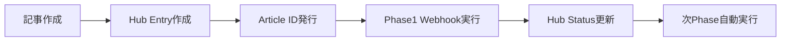

# MEO Operations Hub Integration Guide

**作成日**: 2025-11-05
**目的**: n8nワークフローとNotion MEO Operations Hubデータベースの統合ガイド

---

## 📊 Hub Database構造

### Database ID
- **MEO Operations Hub**: `2a268d5c-2986-813c-a8e5-eba390fb71fd`
- **WF7 動画管理マスタ**: `29b68d5c-2986-817f-b4e6-f84cf75ea9ed`
- **note記事管理DB**: `29968d5c-2986-81ad-90d0-c24ed710503e`

### プロパティ構造

| プロパティ名 | 型 | 用途 |
|-------------|---|-----|
| Title | Title | ページタイトル |
| Article ID | Rich Text | 記事の一意識別子 |
| Workflow Status | Select | Draft/ScriptReady/AssetsReady/NarrationReady/Rendered/Distributed/Failed |
| Channel | Multi-select | LINE/note/YouTube/TikTok/Twitter/Instagram |
| Related Video | Relation | 動画管理DBとのリレーション |
| Related Article | Relation | note記事管理DBとのリレーション |
| Latest Execution ID | Rich Text | n8n実行ID |
| Script JSON | URL | スクリプトファイルURL |
| Assets JSON | URL | アセットファイルURL |
| Render URL | URL | レンダリング済み動画URL |
| Thumbnail URL | URL | サムネイルURL |
| Voice URL | URL | 音声ファイルURL |
| Subtitle URL | URL | 字幕ファイルURL |
| Error Log | Rich Text | エラーログ |
| Schedule Date | Date | 配信予定日 |

---

## 🔧 n8n ワークフロー統合

### 1. Fetch Hub Context Node（共通）

全てのワークフローの冒頭に配置し、Article IDからHub情報を取得します。

```javascript
// ノード名: Fetch Hub Context
// タイプ: Code (JavaScript)
// 位置: 各ワークフローの最初（Webhook後）

// コードは workflows/hub-integration/fetch-hub-context-node.js を使用
```

**設定方法**:
1. Codeノードを追加
2. `fetch-hub-context-node.js`の内容をコピー
3. 前段のノードから`articleId`を受け取るよう設定

### 2. Update Hub Status Node（各Phase終了時）

各Phaseの処理完了後に配置し、Hubのステータスを更新します。

```javascript
// ノード名: Update Hub Status
// タイプ: Code (JavaScript)
// 位置: 各Phase処理の最後

// コードは workflows/hub-integration/update-hub-status-node.js を使用
```

**Phase別設定**:

#### Phase1（スクリプト生成）
```javascript
// phaseNameを設定
const phaseName = 'Phase1';

// 必要なフィールド
$json.scriptUrl = 'https://n8n-python-production-344b.up.railway.app/webhook/wf7-video-script?articleId=' + articleId;
```

#### Phase2（アセット準備）
```javascript
const phaseName = 'Phase2';
$json.assetsUrl = 'https://n8n-python-production-344b.up.railway.app/webhook/wf7-phase2-assets-google?articleId=' + articleId;
```

#### Phase3（音声・字幕生成）
```javascript
const phaseName = 'Phase3';
$json.voiceUrl = 'https://n8n-python-production-344b.up.railway.app/webhook/wf7-files-audio?articleId=' + articleId;
$json.subtitleUrl = 'https://n8n-python-production-344b.up.railway.app/webhook/wf7-files-subtitle?articleId=' + articleId;
```

#### Phase4（レンダリング）
```javascript
const phaseName = 'Phase4';
$json.videoUrl = 'https://n8n-python-production-344b.up.railway.app/webhook/wf7-files-video?articleId=' + articleId;
$json.thumbnailUrl = 'https://n8n-python-production-344b.up.railway.app/webhook/wf7-files-thumb?articleId=' + articleId;
```

#### Phase5（配信）
```javascript
const phaseName = 'Phase5';
$json.channels = ['YouTube', 'TikTok', 'Instagram']; // 実際の配信先
```

---

## 📝 ワークフロー改修手順

### Step 1: 既存ワークフローのバックアップ

```bash
# n8n UIから各ワークフローをエクスポート
# workflows/backups/verified/に保存
```

### Step 2: Fetch Hub Contextノード追加

1. 各ワークフローの最初に「Code」ノードを追加
2. ノード名を「Fetch Hub Context」に変更
3. `fetch-hub-context-node.js`の内容を貼り付け
4. Webhookノードと接続

### Step 3: 既存のNotionノード更新

1. 参照先DBを「MEO Operations Hub」に変更
2. Database ID: `2a268d5c-2986-813c-a8e5-eba390fb71fd`
3. プロパティマッピングを更新

### Step 4: Update Hub Statusノード追加

1. 各Phase処理の最後に「Code」ノードを追加
2. ノード名を「Update Hub Status - Phase[1-5]」に変更
3. `update-hub-status-node.js`の内容を貼り付け
4. phaseNameを適切に設定

### Step 5: エラーハンドリング追加

```javascript
// Error Handlerノード（各ワークフロー共通）
try {
  // Phase処理
} catch (error) {
  // Hub DBにエラーを記録
  const errorContext = {
    phaseName: 'Error',
    error: {
      message: error.message,
      stack: error.stack
    }
  };
  // Update Hub Statusノードを実行
}
```

---

## 🔍 Hubビュー設定

### Kanbanビュー（進捗管理）
- **Group by**: Workflow Status
- **Sort**: Updated At (降順)
- **Filter**: なし

### Tableビュー（詳細確認）
- **Properties**: Article ID, Title, Status, Channel, Latest Execution ID, Error Log
- **Sort**: Created At (降順)
- **Filter**: Status != "Distributed"

### Calendarビュー（配信計画）
- **Date Property**: Schedule Date
- **Display**: Title, Channel, Status

---

## 🚀 運用フロー

### 1. 新規記事の処理



### 2. ステータス遷移

```
Draft → ScriptReady → AssetsReady → NarrationReady → Rendered → Distributed
            ↓             ↓              ↓              ↓           ↓
         Failed        Failed         Failed         Failed     Failed
```

### 3. エラーリカバリ

1. Hub DBで`Status = Failed`のエントリを確認
2. Error Logから原因を特定
3. 問題を修正後、該当Phaseから再実行
4. Hub Statusが自動更新される

---

## 📊 モニタリング

### 日次確認項目

- [ ] Failed状態のエントリ数
- [ ] 各Phaseの滞留時間
- [ ] Channel別の配信状況
- [ ] エラー発生頻度とパターン

### 週次レポート

```javascript
// Hub DBからデータを集計
const weeklyStats = {
  totalProcessed: 0,
  successRate: 0,
  averageProcessingTime: 0,
  errorsByPhase: {},
  distributionByChannel: {}
};
```

---

## 🔧 トラブルシューティング

### よくある問題と解決法

#### 1. Article IDが見つからない
```javascript
// Hub Contextノードで自動作成されるため、エラーにはならない
// ただし、新規作成時はisNewEntry: trueフラグを確認
```

#### 2. ステータス更新が反映されない
- Notion API権限を確認
- Hub DB IDが正しいか確認
- プロパティ名の大文字小文字を確認

#### 3. リレーションが設定できない
- 関連DBへのアクセス権限を確認
- リレーションプロパティの設定を確認

---

## 📚 参考資料

- [Notion API Documentation](https://developers.notion.com/)
- [n8n Workflow Documentation](https://docs.n8n.io/)
- [MEO Operations Hub 再設計計画書](./meo-operations-hub-redesign-plan.md)

---

## 🎯 次のステップ

1. **Phase1-5ワークフロー改修** - 各ワークフローにHub統合を実装
2. **LINE配信フロー統合** - Hub DBからLINE配信対象を自動取得
3. **ダッシュボード作成** - Notion上でKPIビューを構築
4. **自動化ルール設定** - ステータス遷移による自動実行トリガー

---

**最終更新**: 2025-11-05