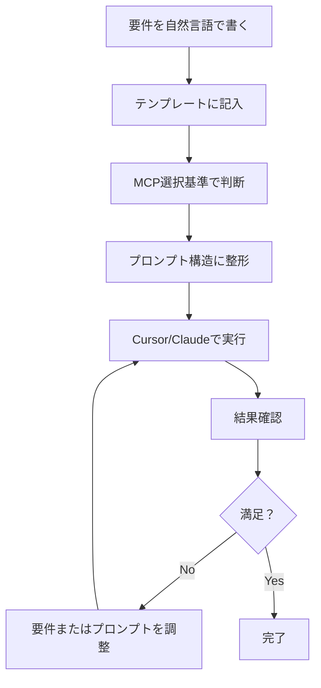

# プロンプト設計指針書

要件定義から最適なプロンプトを作成するためのステップバイステップガイド

---

## 📋 目次

- [概要](#概要)
- [3ステップのワークフロー](#3ステップのワークフロー)
- [ステップ1: 要件定義](#ステップ1-要件定義)
- [ステップ2: プロンプト整形](#ステップ2-プロンプト整形)
- [ステップ3: 実行と改善](#ステップ3-実行と改善)
- [実践例](#実践例)
- [チェックリスト](#チェックリスト)

---

## 🎯 概要

### このガイドの目的

自然言語で書いた要件を、MCPとナレッジベースを最大限活用する最適なプロンプトに変換する方法を学びます。

### 推奨ワークフロー

```
1. 要件定義を書く（このガイドのテンプレート使用）
   ↓
2. プロンプトに整形（構造化ルールに従う）
   ↓
3. 実行して改善（結果を見て調整）
```

### 所要時間

- 要件定義: 5-10分
- プロンプト整形: 3-5分
- 実行と改善: タスクによる

---

## 🔄 3ステップのワークフロー

### 全体像



---

## 📝 ステップ1: 要件定義

### 1.1 要件定義テンプレート

以下のテンプレートをコピーして、自分の言葉で埋めてください。

```markdown
# 要件定義シート

## 1. 基本情報
- タスク名: [わかりやすい名前]
- カテゴリー: [ワークフロー作成/改善/トラブルシューティング/学習/AIエージェント/運用/その他]
- 優先度: [高/中/低]
- 期限: [あれば記入]

## 2. 現状（As-Is）
[現在の状況を説明]
- 何をしていますか？
- どんな問題がありますか？
- 手動でやっている作業は？

## 3. 目標（To-Be）
[理想的な状態を説明]
- 何を実現したいですか？
- 自動化したい作業は？
- 期待する結果は？

## 4. 詳細要件
### 入力
- トリガー: [Webhook/Scheduled/Manual/その他]
- データソース: [LINE/Notion/Gmail/その他]
- データ形式: [JSON/CSV/テキスト/その他]

### 処理
- 処理内容: [具体的に]
- 条件分岐: [あれば]
- データ変換: [あれば]

### 出力
- 保存先: [Notion/Supabase/Google Sheets/その他]
- 通知先: [Slack/Email/Discord/その他]
- 出力形式: [形式を指定]

## 5. 制約条件
- 使用できるサービス: [リスト]
- 使用できないサービス: [あれば]
- パフォーマンス要件: [実行時間、処理量など]
- セキュリティ要件: [データの取り扱いなど]

## 6. 参考情報
- 類似のワークフロー: [あれば]
- 参考URL: [あれば]
- 特記事項: [その他重要な情報]

## 7. 成功の基準
- どうなれば成功と言えますか？
- 測定可能な指標は？
```

### 1.2 要件定義の書き方のコツ

#### ✅ 良い要件定義の例

```markdown
## 2. 現状（As-Is）
- LINE公式アカウントに友だち登録があると、LINEアプリで通知が来る
- 手動でNotionの「リード管理」データベースを開いて新規ページを作成
- ユーザーID、表示名、登録日時を手動で入力している
- 1件あたり3-5分かかる
- 1日10-20件の登録があり、30分-1時間を消費

## 3. 目標（To-Be）
- LINE友だち登録があったら自動的にNotionに記録される
- Slackの#新規リードチャネルに通知が飛ぶ
- エラーが発生したら#エラー通知チャネルに詳細が送られる
- 手動作業ゼロ、リアルタイム処理
```

#### ❌ 悪い要件定義の例

```markdown
## 2. 現状（As-Is）
- 大変

## 3. 目標（To-Be）
- 楽になりたい
```

→ 具体性がなく、プロンプトに変換できません。

### 1.3 要件定義チェックリスト

要件定義を書いたら、以下を確認：

- [ ] タスクの目的が明確か？
- [ ] 現状の問題点が具体的か？
- [ ] 目標が測定可能か？
- [ ] 入力・処理・出力が明確か？
- [ ] 使用するサービスが特定されているか？
- [ ] 制約条件が明記されているか？
- [ ] 成功の基準が定義されているか？

---

## 🔧 ステップ2: プロンプト整形

### 2.1 MCP選択基準

要件定義から適切なMCPを選択します。

#### 選択フローチャート

```
[タスクカテゴリーは？]
  │
  ├─ ワークフロー作成/改善
  │   │
  │   ├─ 新規作成 → @mcp-sequential-thinking @n8n-workflows-docs @n8n-mcp
  │   ├─ 改善 → @n8n-mcp @n8n-workflows-docs
  │   └─ 統合 → @mcp-sequential-thinking @n8n-mcp
  │
  ├─ トラブルシューティング
  │   │
  │   ├─ エラー診断 → @n8n-mcp @n8n-workflows-docs
  │   └─ パフォーマンス → @mcp-sequential-thinking @n8n-mcp @n8n-workflows-docs
  │
  ├─ 学習・調査
  │   │
  │   ├─ ベストプラクティス → @n8n-workflows-docs @n8n-workflows
  │   └─ API調査 → @n8n-workflows-docs @context7-docs
  │
  ├─ AIエージェント
  │   │
  │   ├─ 新規生成 → @mcp-sequential-thinking @n8n-workflows @n8n-mcp
  │   └─ カスタマイズ → @n8n-workflows @n8n-mcp
  │
  ├─ 運用・最適化
  │   │
  │   ├─ 監視設定 → @n8n-mcp @n8n-workflows-docs
  │   └─ バッチ化 → @mcp-sequential-thinking @n8n-mcp @n8n-workflows-docs
  │
  └─ 高度な活用
      │
      ├─ マルチMCP連携 → @mcp-sequential-thinking + 複数MCP
      ├─ バージョン管理 → @n8n-mcp @github
      ├─ ドキュメント生成 → @n8n-mcp @github @n8n-workflows-docs
      └─ CI/CD → @mcp-sequential-thinking @n8n-mcp @github @vercel
```

#### MCP選択クイックリファレンス

| やりたいこと | 必須MCP | オプションMCP |
|------------|---------|--------------|
| 新規ワークフロー | sequential-thinking, n8n-workflows-docs, n8n-mcp | - |
| ワークフロー改善 | n8n-mcp, n8n-workflows-docs | sequential-thinking |
| エラー解決 | n8n-mcp, n8n-workflows-docs | - |
| パフォーマンス改善 | n8n-mcp | sequential-thinking, n8n-workflows-docs |
| ワークフロー例検索 | n8n-workflows-docs | n8n-workflows |
| API調査 | context7-docs | n8n-workflows-docs |
| AIエージェント生成 | sequential-thinking, n8n-workflows, n8n-mcp | - |
| GitHub連携 | github | n8n-mcp |
| Notion操作 | notion | n8n-mcp |
| DB操作 | supabase | n8n-mcp |
| ブラウザ操作 | playwright | - |
| 知識検索 | obsidian | - |

### 2.2 プロンプト構造テンプレート

選択したMCPに応じて、以下のテンプレートを使用します。

#### 基本構造

```markdown
@[MCP1]
@[MCP2]
@[MCP3]

[1行で要約：何をしたいか]

【背景・現状】
[要件定義の「現状」をコピー]

【目標・要件】
[要件定義の「目標」と「詳細要件」をコピー]

【制約条件】
[要件定義の「制約条件」をコピー]

【依頼内容】
1. [具体的なステップ1]
2. [具体的なステップ2]
3. [具体的なステップ3]
4. [具体的なステップ4]

【参考情報】
- [ワークフローID（あれば）]
- [参考ドキュメント（あれば）]
```

#### ワークフロー作成用（詳細版）

```markdown
@mcp-sequential-thinking
@n8n-workflows-docs
@n8n-mcp

[ワークフロー名]を作成したいです。段階的に設計して実装してください。

【背景・現状】
- 現在の状況: [具体的に]
- 問題点: [何が困っているか]
- 手動作業: [どんな作業を自動化したいか]

【目標・要件】
目的: [最終的に何を実現したいか]

トリガー: [Webhook/Scheduled/Manual]
入力データ: 
- ソース: [LINE/Gmail/HTTP など]
- 形式: [JSON/CSV/テキスト]
- サンプル: [可能なら]

処理内容:
1. [ステップ1の説明]
2. [ステップ2の説明]
3. [ステップ3の説明]

出力:
- 保存先: [Notion/Supabase/Sheets]
- 通知先: [Slack/Email/Discord]
- エラー時: [どう処理するか]

【制約条件】
- 使用サービス: [利用可能なサービスリスト]
- パフォーマンス: [実行時間の目標]
- セキュリティ: [データの取り扱い]

【依頼内容】
1. Sequential Thinkingで設計を段階的に考える
   - 類似のワークフロー例をZie619から探す
   - 最適なノード構成を検討
   - エラーハンドリング戦略を立てる

2. n8n-workflows-docsで参考例を探す
   - 類似のパターンを検索
   - ベストプラクティスを確認
   - 実装のヒントを得る

3. n8n-mcpで実装
   - ノードを作成
   - 接続を設定
   - テスト実行

4. バリデーションと最適化
   - エラーチェック
   - パフォーマンス確認
   - 改善提案

【参考情報】
- 類似ワークフロー: [あれば記入]
- 参考URL: [あれば記入]
```

#### トラブルシューティング用

```markdown
@n8n-mcp
@n8n-workflows-docs

ワークフローでエラーが発生しています。診断と解決をお願いします。

【ワークフロー情報】
ID: [WORKFLOW_ID]
名前: [WORKFLOW_NAME]
URL: [n8nのワークフローURL]

【エラー内容】
発生日時: [いつから]
エラーメッセージ: 
```
[エラーメッセージを完全にコピペ]
```

発生ノード: [ノード名]
発生頻度: [毎回/時々/稀に]
再現条件: [どういう時に発生するか]

【現在の状況】
- [他のノードは正常か]
- [以前は動いていたか]
- [最近変更した点は？]

【試したこと】
- [既に試した解決策]

【依頼内容】
1. ワークフローの構造を確認
2. エラー原因を特定
3. Zie619から類似のエラー解決例を探す
4. 具体的な修正方法を提示
5. 修正を実装してテスト
```

#### 学習・調査用

```markdown
@n8n-workflows-docs
@context7-docs

[トピック名]について学習したいです。

【学習の目的】
- [なぜ学びたいか]
- [どこで使う予定か]

【知りたいこと】
1. [質問1]
2. [質問2]
3. [質問3]

【現在のレベル】
- [初心者/中級者/上級者]
- [既に知っていること]

【依頼内容】
1. 基本概念の説明
2. Zie619から優れた実装例を5-10個ピックアップ
3. 公式ドキュメントの重要ポイント（context7-docs）
4. よくある失敗パターンとその回避方法
5. ベストプラクティス
6. 実践的なチェックリスト

【特に詳しく知りたい点】
- [具体的なトピック]
```

### 2.3 プロンプト整形チェックリスト

プロンプトを書いたら、以下を確認：

- [ ] 適切なMCPが選択されているか？
- [ ] 要件が構造化されているか？
- [ ] 具体的なステップが明示されているか？
- [ ] 制約条件が含まれているか？
- [ ] 参考情報が提供されているか？
- [ ] 期待する結果が明確か？
- [ ] 1つのプロンプトで1つのタスクに集中しているか？

---

## ✅ ステップ3: 実行と改善

### 3.1 実行手順

1. **プロンプトをコピー**
   - 整形したプロンプト全体を選択してコピー

2. **Cursor/Claudeに貼り付け**
   - 新しいチャットを開始
   - プロンプトを貼り付け

3. **実行を待つ**
   - MCPが動作するまで待つ
   - 途中経過を確認

4. **結果を確認**
   - 期待通りの結果か？
   - 追加で必要な情報は？

### 3.2 結果の評価

#### ✅ 成功の兆候

- 明確な回答が得られた
- 実装可能な具体的な手順が提示された
- エラーが解決された
- 期待する成果物（ワークフロー、コードなど）が生成された

#### ⚠️ 改善が必要な兆候

- 回答が曖昧
- 追加情報を何度も求められる
- エラーが解決しない
- 期待と違う結果

### 3.3 改善のアプローチ

#### パターンA: 要件を明確化

**問題**: 「もっと詳しく教えてください」と言われる

**改善策**:
```markdown
# 元の要件定義に戻る
# 「詳細要件」セクションをより具体的に書く

例:
❌ 処理内容: データを変換する
✅ 処理内容: 
   1. JSONからuserIdフィールドを抽出
   2. displayNameが空の場合は"Unknown"を設定
   3. timestampをISO 8601形式に変換
```

#### パターンB: MCPを追加

**問題**: 参考例が見つからない

**改善策**:
```markdown
# プロンプトにMCPを追加

元:
@n8n-mcp

改善:
@n8n-mcp
@n8n-workflows-docs  ← 追加（参考例検索のため）
```

#### パターンC: ステップを分割

**問題**: 一度に多くのことを依頼しすぎた

**改善策**:
```markdown
# 大きなタスクを小さく分割

元のプロンプト（大きすぎる）:
「LINE CRMシステム全体を作成して」

改善（分割）:
プロンプト1: 「まずLINE Webhook受信部分を作成」
プロンプト2: 「次にNotionへのデータ保存を実装」
プロンプト3: 「最後にSlack通知を追加」
```

#### パターンD: コンテキストを追加

**問題**: AIが状況を理解できていない

**改善策**:
```markdown
# 「背景・現状」セクションを詳しく

元:
【背景・現状】
- LINEとNotionを連携したい

改善:
【背景・現状】
- 現在: LINE公式アカウント運用中（友だち500人）
- 現在: Notionで顧客管理（月間100件の新規登録）
- 問題: 手動でコピペしているため1件5分、週5時間消費
- 環境: n8n on Railway、Notion Enterpriseプラン
- チーム: 3人でワークフローを共有予定
```

### 3.4 イテレーションのベストプラクティス

```
実行 → 評価 → 改善 → 実行

最大3回のイテレーションで目標達成を目指す

1回目: 大枠を作る
2回目: 細部を調整
3回目: 最終確認と最適化
```

---

## 💡 実践例

### 例1: LINE CRM統合ワークフロー

#### ステップ1: 要件定義

```markdown
# 要件定義シート

## 1. 基本情報
- タスク名: LINE友だち追加自動記録システム
- カテゴリー: ワークフロー作成
- 優先度: 高
- 期限: 2週間以内

## 2. 現状（As-Is）
- LINE公式アカウントに友だち登録がある
- LINEアプリで通知を受け取る
- 手動でNotionを開いて「リード管理」データベースに新規ページ作成
- ユーザーID、表示名、登録日時を手入力
- 1件あたり3-5分かかる
- 1日平均15件の登録 = 45-75分を消費

## 3. 目標（To-Be）
- LINE友だち登録を自動検知
- 即座にNotionの「リード管理」DBに記録
- Slackの#新規リードチャネルに通知
- エラー時は#エラー通知に詳細を送信
- 手動作業ゼロ、処理時間5秒以内

## 4. 詳細要件
### 入力
- トリガー: Webhook（LINE Messaging API）
- データソース: LINE Webhook
- データ形式: JSON

### 処理
- Webhook受信 → 友だち追加イベントを判定
- ユーザー情報抽出（userId, displayName, timestamp）
- Notionページ作成（プロパティ設定）
- Slack通知送信

### 出力
- 保存先: Notion「リード管理」データベース
- 通知先: Slack #新規リード
- エラー通知: Slack #エラー通知

## 5. 制約条件
- 使用サービス: LINE Messaging API, Notion API, Slack API
- 実行環境: Railway上のn8n
- パフォーマンス: 5秒以内に処理完了
- セキュリティ: Webhook署名検証必須

## 6. 参考情報
- 既存の手動プロセスのスクリーンショットあり
- NotionデータベースID: xxx-yyy-zzz

## 7. 成功の基準
- 友だち追加から5秒以内にNotionに記録される
- 1日の手動作業時間が45-75分 → 0分
- エラー率1%以下
```

#### ステップ2: プロンプト整形

```markdown
@mcp-sequential-thinking
@n8n-workflows-docs
@n8n-mcp

LINE友だち追加を自動的にNotionに記録するワークフローを作成したいです。

【背景・現状】
- LINE公式アカウント運用中（現在友だち500人）
- 友だち追加があると手動でNotionの「リード管理」データベースに記録
- 1件あたり3-5分、1日平均15件で45-75分を消費
- リアルタイム性がなく、記録漏れもある

【目標・要件】
目的: LINE友だち追加の完全自動記録とSlack通知

トリガー: Webhook（LINE Messaging API）
入力データ:
```json
{
  "events": [{
    "type": "follow",
    "timestamp": 1234567890,
    "source": {
      "type": "user",
      "userId": "U1234567890"
    }
  }]
}
```

処理内容:
1. LINE Webhookを受信（署名検証含む）
2. イベントタイプが"follow"（友だち追加）か判定
3. ユーザーID、タイムスタンプを抽出
4. LINE APIでユーザー情報取得（displayName, pictureUrl）
5. Notionの「リード管理」DBに新規ページ作成
   - プロパティ:
     - ユーザーID（テキスト）
     - 表示名（タイトル）
     - 登録日時（日付）
     - ステータス（セレクト: "新規"）
6. Slackの#新規リードに通知
   - メッセージ: "新規友だち: {表示名} (ID: {ユーザーID})"
7. エラー時はSlackの#エラー通知に詳細送信

出力:
- Notion: 新規ページ作成
- Slack: #新規リード/#エラー通知に送信

【制約条件】
- 使用サービス: LINE Messaging API, Notion API, Slack API（すべて認証情報設定済み）
- 実行環境: Railway上のn8n（v1.0以上）
- パフォーマンス: 5秒以内に処理完了
- セキュリティ: LINE Webhook署名検証必須
- NotionデータベースID: abc123-def456-ghi789

【依頼内容】
1. Sequential Thinkingで設計を段階的に考える
   - Zie619から類似のLINE Webhookワークフローを探す
   - エラーハンドリング戦略（署名検証失敗、API呼び出し失敗）
   - 最適なノード構成を検討

2. n8n-workflows-docsで参考例を探す
   - LINE Webhook受信のパターン
   - Notion API連携のベストプラクティス
   - Slack通知の実装例

3. n8n-mcpで実装
   - Webhookノード作成（署名検証設定）
   - IFノードで友だち追加判定
   - HTTP RequestノードでLINE API呼び出し
   - Notionノードでページ作成
   - Slackノードで通知送信
   - エラーハンドリング設定

4. バリデーションとテスト
   - テストWebhookで動作確認
   - エラーケースのテスト
   - パフォーマンス確認

【参考情報】
- NotionデータベースID: abc123-def456-ghi789
- Slackチャネル: #新規リード (#C01ABC123), #エラー通知 (#C01DEF456)
```

#### ステップ3: 実行結果（想定）

**1回目の実行**:
- ワークフローが作成される
- ただし、署名検証の実装が不完全

**改善プロンプト**:
```markdown
@n8n-mcp

作成されたワークフローの署名検証部分を強化したいです。

【現状】
ワークフローID: [生成されたID]
署名検証が基本的な実装のみ

【改善要求】
1. LINE Webhookの署名検証を厳密に実装
2. 検証失敗時は処理を中止してSlackに警告
3. Zie619から署名検証の参考例を探して適用

【参考】
https://developers.line.biz/ja/reference/messaging-api/#signature-validation
```

**2回目の実行**:
- 署名検証が強化される
- エラーハンドリングも改善される
- 完成！

---

### 例2: パフォーマンス改善

#### ステップ1: 要件定義

```markdown
# 要件定義シート

## 1. 基本情報
- タスク名: データ同期ワークフローのパフォーマンス改善
- カテゴリー: 改善/最適化
- 優先度: 中
- 期限: 1週間

## 2. 現状（As-Is）
- 毎時Google Sheetsから100件のデータを取得
- 1件ずつNotionに同期（更新または作成）
- 処理時間: 平均15-20分
- タイムアウトが時々発生（n8nの実行時間制限）

## 3. 目標（To-Be）
- 同じ処理を5分以内に完了
- タイムアウトエラーをゼロに
- 並列処理またはバッチ処理で高速化

## 4. 詳細要件
### 入力
- トリガー: Scheduled（毎時0分）
- データソース: Google Sheets
- データ量: 100件/回

### 処理
- 現在: 1件ずつループ処理
- 改善後: バッチまたは並列処理

### 出力
- 保存先: Notion
- 通知先: 完了時にSlack

## 5. 制約条件
- API レート制限: Notion API 3 requests/sec
- n8n実行時間制限: 30分
- データの整合性は維持

## 6. 参考情報
- 既存ワークフローID: XYZ123
- Google SheetsのシートID: abc123

## 7. 成功の基準
- 処理時間: 15-20分 → 5分以内
- タイムアウトエラー: 削減率100%
```

#### ステップ2: プロンプト整形

```markdown
@mcp-sequential-thinking
@n8n-mcp
@n8n-workflows-docs

既存のデータ同期ワークフローを高速化したいです。

【ワークフロー情報】
ID: XYZ123
名前: Google Sheets - Notion Sync
現在の処理時間: 15-20分
目標処理時間: 5分以内

【現在の構造】
1. Scheduled Trigger (毎時)
2. Google Sheets - Read (100行)
3. Loop Over Items (1件ずつ)
4. Notion - Update or Create
5. Slack通知

【問題点】
- 1件ずつの順次処理で遅い
- 時々タイムアウト（30分制限）
- Notion APIを効率的に使えていない

【改善要求】
目標: 処理時間を5分以内に短縮

制約:
- Notion API レート制限: 3 requests/sec
- データ整合性は維持
- エラーハンドリングも考慮

【依頼内容】
1. Sequential Thinkingで最適化戦略を考える
   - バッチ処理 vs 並列処理
   - APIレート制限への対応
   - エラーハンドリング

2. 現在のワークフローを分析
   - ボトルネックを特定
   - 改善ポイントをリスト化

3. Zie619からバッチ処理の例を探す
   - Notionへの効率的な書き込みパターン
   - 並列処理の実装例

4. 改善版を実装
   - バッチサイズの最適化
   - エラーリカバリー
   - 進捗通知

5. パフォーマンステスト
   - 改善前後の比較
   - タイムアウト発生の有無
```

---

### 例3: AIエージェント生成

#### ステップ1: 要件定義

```markdown
# 要件定義シート

## 1. 基本情報
- タスク名: 不動産管理会社向けAIエージェント軍
- カテゴリー: AIエージェント
- 優先度: 高
- 期限: 2週間

## 2. 現状（As-Is）
- 50物件の賃貸管理
- テナントからの問い合わせに手動対応（月間100件）
- メンテナンスリクエストの手動管理
- 契約更新の手動通知
- Excel/Notionで管理（統一されていない）

## 3. 目標（To-Be）
- AIエージェントが問い合わせに自動対応
- メンテナンスリクエストを自動分類・割り当て
- 契約更新を自動通知
- 全てNotionで統一管理
- 人的工数を50%削減

## 4. 詳細要件
### エージェント構成
- マスターエージェント: クエリルーティング
- テナント対応エージェント: 問い合わせ処理
- メンテナンスエージェント: リクエスト管理
- 契約管理エージェント: 更新通知
- (その他2-3個のエージェント)

### 使用ツール
- Notion（物件DB、テナントDB、メンテナンスDB）
- Gmail（メール対応）
- Slack（内部通知）
- Google Calendar（スケジュール管理）

## 5. 制約条件
- 使用MCP: OpenAI GPT-4
- データ: Notionに集約
- セキュリティ: テナント情報の保護

## 6. 参考情報
- 既存のRetroFutureエージェント（8個）を参考に

## 7. 成功の基準
- 自動対応率: 70%以上
- 平均応答時間: 5分以内
- 人的工数削減: 50%
```

#### ステップ2: プロンプト整形

```markdown
@mcp-sequential-thinking
@n8n-workflows
@n8n-mcp

不動産管理会社向けのAIエージェント軍を作成したいです。

【ビジネス情報】
業種: 不動産管理（賃貸50物件）
従業員: 5名（営業2名、管理3名）
使用ツール: 
- Notion（物件DB、テナントDB、メンテナンスDB、契約DB）
- Gmail（メール対応）
- Slack（内部コミュニケーション）
- Google Calendar（スケジュール）

自動化したい業務:
1. テナント問い合わせ対応（月100件、1件平均15分）
2. メンテナンスリクエスト管理（月50件、1件平均30分）
3. 契約更新通知（月10件、1件平均20分）
4. 家賃支払い追跡（月50件、1件平均10分）
5. 物件状況レポート生成（週1回、2時間）

【現状の問題】
- 手動対応で時間がかかる（月間100時間以上）
- データが分散（Excel、Notion、メール）
- 対応漏れや遅延が発生
- スケーラビリティがない

【要件】
1. workflows/ai-agents/agent-army-generator-prompt.mdを読む
2. RetroFutureエージェント8個（下記ファイル）を参考に構造を理解
3. 不動産管理向けの6-8個のエージェントを提案
4. 最優先の3個（テナント対応、メンテナンス、契約管理）を完全実装

【エージェント案（仮）】
1. マスターコーディネーター
2. テナント対応エージェント（優先度: 高）
3. メンテナンス管理エージェント（優先度: 高）
4. 契約管理エージェント（優先度: 高）
5. 家賃追跡エージェント
6. 物件分析エージェント
7. (その他)

【参考にするファイル】
- workflows/ai-agents/retrofuture-master-assistant.json（マスター構造）
- workflows/ai-agents/retrofuture-customer-experience-agent.json（顧客対応）
- workflows/ai-agents/retrofuture-artisan-production-agent.json（管理系）

【依頼内容】
1. まず全体設計をSequential Thinkingで考える
   - 6-8個のエージェントを具体的に提案
   - 各エージェントの役割と使用ツールを定義
   - データフローを設計

2. agent-army-generator-prompt.mdのプロンプトを読んで理解

3. RetroFutureエージェントのJSONを参考に構造を学ぶ

4. 最優先3個のエージェントを実装
   - 完全なワークフローJSON
   - 適切なツール接続
   - エラーハンドリング

5. マスターコーディネーターを実装
   - 全6-8個のエージェントへのルーティング
   - プレースホルダーworkflowID使用

【制約】
- OpenAI GPT-4使用
- Notionにデータ集約
- テナント情報の保護
- 実証済みのツールのみ使用

【成功の基準】
- 4つのJSON（マスター + 専門3個）生成
- インポート可能で接続エラーなし
- 実際に動作するツール構成
```

---

## 📋 チェックリスト

### 要件定義完了チェックリスト

- [ ] タスク名が明確
- [ ] カテゴリーが選択されている
- [ ] 現状（As-Is）が具体的に記述されている
- [ ] 目標（To-Be）が明確で測定可能
- [ ] 入力・処理・出力が定義されている
- [ ] 制約条件がリストされている
- [ ] 参考情報が提供されている（あれば）
- [ ] 成功の基準が定義されている

### プロンプト整形完了チェックリスト

- [ ] 適切なMCPが選択されている
- [ ] 1行要約がある
- [ ] 背景・現状が記述されている
- [ ] 目標・要件が構造化されている
- [ ] 制約条件が含まれている
- [ ] 依頼内容が具体的なステップで記述されている
- [ ] 参考情報が提供されている（あれば）
- [ ] 1つのタスクに集中している

### 実行前チェックリスト

- [ ] プロンプト全体を確認
- [ ] 誤字脱字がない
- [ ] ワークフローIDやデータベースIDが正しい
- [ ] 期待する結果が明確
- [ ] 必要なファイル/情報が準備されている

### 実行後評価チェックリスト

- [ ] 期待通りの回答が得られた
- [ ] 実装可能な内容か
- [ ] エラーや警告がないか
- [ ] 追加の質問が必要か
- [ ] 次のステップが明確か

---

## 💡 ベストプラクティス

### DO（推奨）

✅ **具体的に書く**
```
❌ データを処理したい
✅ 100件のJSONデータから"name"と"email"フィールドを抽出し、
   @が含まれないemailは除外して、Notionに保存したい
```

✅ **段階的に進める**
```
大きなタスクは3-5個のプロンプトに分割
各プロンプトで1つのことに集中
```

✅ **参考を示す**
```
「Zie619の類似例を参考に」
「workflows/ai-agents/のエージェントを参考に」
「既存のワークフローID: XYZ123を改善」
```

✅ **制約を明示する**
```
- APIレート制限: 3 req/sec
- 実行時間制限: 5分以内
- データサイズ: 最大1000件
```

### DON'T（避ける）

❌ **曖昧な表現**
```
❌ いい感じにして
❌ よろしく
❌ 適当に
```

❌ **一度に多くを依頼**
```
❌ 「LINE、Notion、Slack、GitHub、Supabaseを全部連携して
    完璧なCRMシステムを作って」
```

❌ **コンテキスト不足**
```
❌ 「エラーが出ます」
✅ 「ワークフローID XYZ123でエラー発生。
    エラーメッセージ: [完全なメッセージ]
    発生ノード: Notion
    発生条件: 特定のユーザーIDの時のみ」
```

❌ **MCPの無駄遣い**
```
❌ 全てのMCPを毎回指定
✅ 必要なMCPのみを選択
```

---

## 🎓 学習パス

### 初級（1-2週間）

**目標**: 基本的な要件定義とプロンプト作成

1. この指針書を読む（30分）
2. 例1（LINE CRM）を試す（1時間）
3. 自分の簡単なタスクで練習（5回以上）
4. うまくいった例・失敗した例を記録

### 中級（2-4週間）

**目標**: 複雑な要件の構造化とMCP選択の最適化

1. 例2（パフォーマンス改善）を試す
2. 複数MCPの連携パターンを学ぶ
3. イテレーション（改善サイクル）を実践
4. 自分用のテンプレートを作成

### 上級（1-2ヶ月）

**目標**: AIエージェント生成や高度な統合

1. 例3（AIエージェント）を試す
2. マルチMCP連携を実践
3. カスタムテンプレートを公開
4. コミュニティに貢献

---

## 🔗 関連リソース

- [プロンプトテンプレート集](prompt-templates.md) - 15種類の実践例
- [ベストプラクティス](best-practices.md) - n8n開発の原則
- [n8n-MCP使用ガイド](mcp/n8n-mcp-usage-guide.md) - 詳細な使用方法
- [Zie619ワークフロー検索ガイド](mcp/zie619-n8n-workflows-guide.md) - 2,053ワークフロー検索
- [AIエージェント生成プロンプト](../workflows/ai-agents/agent-army-generator-prompt.md) - エージェント軍の作り方

---

## 📝 テンプレートファイル

このディレクトリに以下のテンプレートを作成できます：

### requirement-template.md
```markdown
# 要件定義テンプレート

[上記の「要件定義テンプレート」をコピー]
```

### prompt-template.md
```markdown
# プロンプトテンプレート

[上記の「プロンプト構造テンプレート」をコピー]
```

---

**作成日**: 2025-10-26  
**最終更新**: 2025-10-26  
**バージョン**: 1.0  
**対象**: n8nワークフロー開発者（全レベル）

