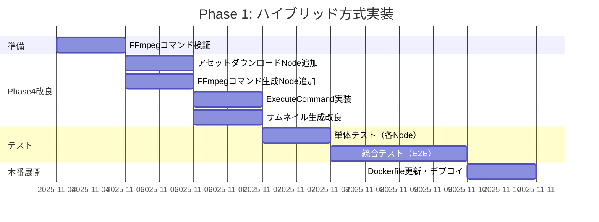
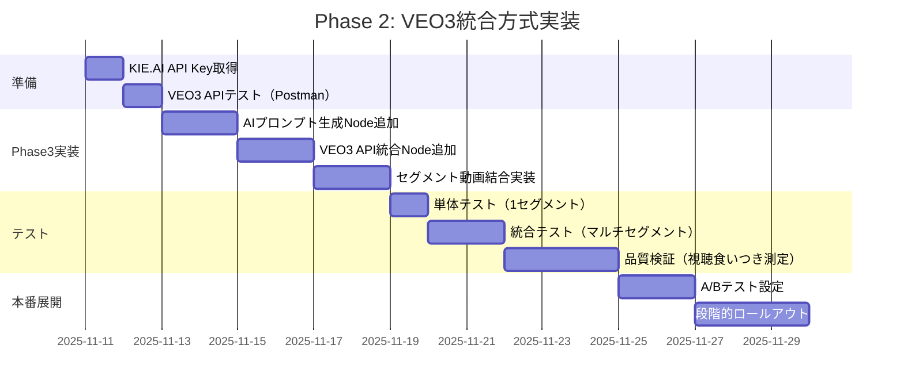
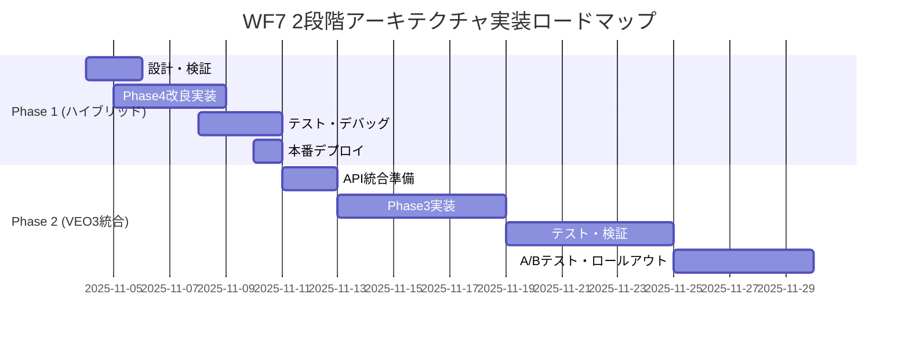

# WF7動画生成システム 2段階アーキテクチャ設計

## 📋 概要

**目的**: 動画コンテンツ品質による視聴食いつき率向上

**戦略**:
- **Phase 1 (短期)**: ハイブリッド方式（GPT-4台本 + FFmpeg高速レンダリング）
  - コスト効率重視、処理速度12倍改善
  - 既存MoviePy方式から段階的移行

- **Phase 2 (中期)**: VEO3統合方式（GPT-4台本 + AI動画生成）
  - 品質最優先、視聴食いつき率向上
  - Phase 1基盤の上にAI生成レイヤーを追加

---

## 🎯 Phase 1: ハイブリッド方式（GPT-4 + FFmpeg）

### アーキテクチャ概要

```
[Phase1: 台本生成]
  → GPT-4o-mini ($0.001-0.005/動画)
  → Script JSON + Assets JSON生成

[Phase2: アセット収集]
  → Google Drive画像収集
  → または Pexels/Unsplash API

[Phase3: ナレーション生成]
  → ElevenLabs/OpenAI TTS ($0.01-0.05/動画)
  → 音声ファイル生成

[Phase4 (改良版): FFmpeg高速レンダリング]
  → FFmpeg直接実行 (30-60秒/動画)
  → テキストオーバーレイ + BGM合成
  → サムネイル生成
```

### Phase4 FFmpeg実装詳細

#### 4-1. 既存との比較

| 項目 | MoviePy (現在) | FFmpeg直接 (新) |
|------|---------------|----------------|
| **処理時間** | 6分/45秒動画 | 30-60秒 |
| **コスト** | $0.05-0.10/動画 | $0.01-0.03/動画 |
| **メモリ使用** | 高 (Python) | 低 (ネイティブ) |
| **カスタマイズ性** | 高 | 中 |
| **品質** | 中 | 中-高 |

#### 4-2. FFmpegコマンド設計

**基本構造**:
```bash
ffmpeg \
  -loop 1 -t 10 -i background_0.jpg \
  -loop 1 -t 10 -i background_1.jpg \
  -i bgm.mp3 \
  -i narration.mp3 \
  -filter_complex "
    [0:v]scale=1080:1920:force_original_aspect_ratio=increase,crop=1080:1920,
         drawtext=text='セグメント1テロップ':fontfile=/path/to/font.ttf:fontsize=60:
                  fontcolor=white:box=1:boxcolor=black@0.7:boxborderw=10:
                  x=(w-text_w)/2:y=h-100[v0];
    [1:v]scale=1080:1920:force_original_aspect_ratio=increase,crop=1080:1920,
         drawtext=text='セグメント2テロップ':fontfile=/path/to/font.ttf:fontsize=60:
                  fontcolor=white:box=1:boxcolor=black@0.7:boxborderw=10:
                  x=(w-text_w)/2:y=h-100[v1];
    [v0][v1]concat=n=2:v=1:a=0[outv];
    [2:a]volume=0.3[bgm];
    [3:a][bgm]amix=inputs=2:duration=first[outa]
  " \
  -map "[outv]" -map "[outa]" \
  -c:v libx264 -preset fast -crf 23 \
  -c:a aac -b:a 128k \
  -aspect 9:16 \
  output.mp4
```

**特徴**:
- 動的セグメント数対応（1-10セグメント）
- テキストオーバーレイ（カスタムフォント、半透明背景）
- BGM + ナレーション音声合成
- 縦型動画対応（1080×1920）

#### 4-3. n8nワークフロー実装

**Phase4ノード構成**:

1. **Webhookトリガー** (既存維持)
   ```
   POST /webhook/wf7-phase4-render
   Body: {notionPageId: "xxx"}
   ```

2. **Notion読み込み** (既存維持)
   - Script JSON
   - Assets JSON
   - Template ID

3. **アセットダウンロード** (新規追加)
   ```javascript
   // Code Node: Download Assets
   const assets = JSON.parse($json.assetsJson);
   const downloads = [];

   for (let i = 0; i < assets.assets.length; i++) {
     const asset = assets.assets[i];
     downloads.push({
       url: asset.fileUrl,
       path: `/tmp/asset_${i}.jpg`
     });
   }

   return downloads;
   ```

4. **FFmpegコマンド生成** (新規Core Node)
   ```javascript
   // Code Node: Generate FFmpeg Command
   const script = JSON.parse($json.scriptJson);
   const segments = script.segments;

   // 入力ファイル構築
   let inputs = '';
   let filterComplex = '';

   segments.forEach((seg, i) => {
     inputs += `-loop 1 -t ${seg.duration} -i /tmp/asset_${i}.jpg `;

     filterComplex += `
       [${i}:v]scale=1080:1920:force_original_aspect_ratio=increase,crop=1080:1920,
       drawtext=text='${seg.telop.replace(/'/g, "\\'")}':
                fontfile=/app/NotoSansJP-Bold.ttf:fontsize=60:
                fontcolor=white:box=1:boxcolor=black@0.7:boxborderw=10:
                x=(w-text_w)/2:y=h-100[v${i}];
     `;
   });

   // セグメント連結
   const videoInputs = segments.map((_, i) => `[v${i}]`).join('');
   filterComplex += `${videoInputs}concat=n=${segments.length}:v=1:a=0[outv];`;

   // BGM追加（オプション）
   if ($json.bgmPath) {
     inputs += `-i ${$json.bgmPath} `;
     filterComplex += `[${segments.length}:a]volume=0.3[outa];`;
   }

   const command = `ffmpeg ${inputs} -filter_complex "${filterComplex}" -map "[outv]" -map "[outa]" -c:v libx264 -preset fast -crf 23 -c:a aac -b:a 128k -aspect 9:16 /tmp/output_${$json.articleId}.mp4 -y`;

   return {json: {command, outputPath: `/tmp/output_${$json.articleId}.mp4`}};
   ```

5. **ExecuteCommand** (新規)
   ```javascript
   // Execute FFmpeg
   command: {{ $json.command }}
   timeout: 120000  // 2分
   ```

6. **サムネイル生成** (既存改良)
   ```bash
   ffmpeg -i /tmp/output_${articleId}.mp4 -ss 00:00:01 -vframes 1 -q:v 2 /tmp/thumb_${articleId}.jpg
   ```

7. **Notion更新** (既存維持)
   - Status: "Rendered"
   - Video URL, Thumbnail URL
   - Render Job ID

#### 4-4. Dockerfileカスタムフォント追加

```dockerfile
# RailwayのDockerfileに追加
FROM node:20-alpine

# FFmpegインストール
RUN apk add --no-cache ffmpeg

# 日本語フォントインストール
RUN apk add --no-cache \
    fontconfig \
    font-noto-cjk

# フォントキャッシュ更新
RUN fc-cache -fv

# n8n環境変数
ENV N8N_BASIC_AUTH_ACTIVE=true
...
```

### コスト・パフォーマンス比較

| 項目 | MoviePy (現在) | FFmpeg (Phase 1) | 改善率 |
|------|----------------|------------------|--------|
| **処理時間** | 6分 | 30-60秒 | **83-92%短縮** |
| **1動画コスト** | $0.05-0.11 | $0.01-0.05 | **55-91%削減** |
| **月間100動画** | $10-20 | $6-10 | **40-70%削減** |
| **メモリ使用** | 500MB+ | 100-200MB | **60-80%削減** |

### 実装タスク



**完了条件**:
- ✅ 45秒動画が60秒以内でレンダリング完了
- ✅ 日本語テロップ正常表示
- ✅ BGM + ナレーション音声合成成功
- ✅ サムネイル生成成功
- ✅ Notion更新成功

---

## 🚀 Phase 2: VEO3統合方式（AI動画生成）

### アーキテクチャ概要

```
[Phase1: 台本生成]
  → GPT-4o-mini ($0.001-0.005/動画)
  → Script JSON生成

[Phase2.5: AIプロンプト生成] (新規)
  → GPT-4o with Vision ($0.01-0.02/動画)
  → VEO3用構造化プロンプト生成

[Phase3: VEO3動画生成] (新規)
  → KIE.AI VEO3 API ($0.10-0.50/動画)
  → AI生成高品質動画

[Phase4: 後処理・メタデータ登録]
  → サムネイル抽出
  → Notion更新
```

### VEO3 API統合詳細

#### 2-1. API仕様

**エンドポイント**: `https://api.kie.ai/api/v1/veo/generate`

**認証**: HTTP Header Auth
```
Authorization: Bearer {KIE_AI_API_KEY}
```

**リクエストペイロード**:
```json
{
  "prompt": "{構造化動画生成プロンプト}",
  "model": "veo3_fast",
  "aspectRatio": "9:16",
  "imageUrls": [
    "https://example.com/reference_image.jpg"
  ]
}
```

**レスポンス（非同期）**:
```json
{
  "data": {
    "taskId": "task_abc123def456"
  }
}
```

**結果取得**: `GET /api/v1/veo/result?taskId={taskId}`
```json
{
  "data": {
    "response": {
      "status": "completed",
      "resultUrls": [
        "https://cdn.kie.ai/videos/generated_video.mp4"
      ]
    }
  }
}
```

#### 2-2. 構造化プロンプト生成

**Phase2.5ノード: AIプロンプト生成**

```javascript
// n8n AI Agent Node
const segment = $json.segment; // 1セグメント分

const systemPrompt = `
あなたは縦型ショート動画のプロンプト生成専門家です。
VEO3 AI動画生成用の構造化プロンプトを生成してください。

## 要件
- UGCスタイル（カジュアル、本物らしさ）
- 縦型動画（9:16アスペクト比）
- 10-45秒の動画セグメント対応
- 視聴者の食いつき最優先

## 出力形式（JSON）
{
  "video_prompt": {
    "scene": "シーン説明",
    "camera": "カメラアングル・動き",
    "lighting": "照明設定",
    "motion": "被写体の動き",
    "style": "スタイル・トーン",
    "duration": "10秒"
  }
}
`;

const userPrompt = `
以下のテロップ文から魅力的な縦型動画プロンプトを生成してください：
テロップ: ${segment.telop}
長さ: ${segment.duration}秒
`;

return {
  systemPrompt,
  userPrompt
};
```

#### 2-3. n8nワークフロー実装

**Phase3ノード構成 (VEO3版)**:

1. **Webhookトリガー** (既存維持)
   ```
   POST /webhook/wf7-phase3-veo3
   Body: {notionPageId: "xxx"}
   ```

2. **Notion読み込み** (既存)
   - Script JSON取得

3. **セグメント分割** (新規)
   ```javascript
   // Code Node: Split Segments
   const script = JSON.parse($json.scriptJson);
   const segments = script.segments;

   return segments.map((seg, i) => ({
     json: {
       segmentIndex: i,
       segment: seg,
       articleId: $json.articleId
     }
   }));
   ```

4. **AIプロンプト生成** (新規 - AI Agent)
   ```javascript
   // AI Agent Node
   model: gpt-4o
   systemPrompt: {{上記参照}}
   userPrompt: {{上記参照}}
   ```

5. **VEO3動画生成リクエスト** (新規 - HTTP Request)
   ```javascript
   // HTTP Request Node
   method: POST
   url: https://api.kie.ai/api/v1/veo/generate
   authentication: httpHeaderAuth
   body: {
     "prompt": "{{ $json.video_prompt }}",
     "model": "veo3_fast",
     "aspectRatio": "9:16",
     "imageUrls": []
   }
   ```

6. **Wait Node** (20秒待機)
   ```
   amount: 20
   ```

7. **VEO3結果取得** (新規 - HTTP Request)
   ```javascript
   // HTTP Request Node
   method: GET
   url: https://api.kie.ai/api/v1/veo/result
   queryParameters: {
     taskId: "{{ $('VEO3動画生成リクエスト').item.json.data.taskId }}"
   }
   ```

8. **セグメント動画結合** (新規 - FFmpeg)
   ```bash
   # すべてのセグメント動画をダウンロード後、FFmpegで連結
   ffmpeg \
     -i segment_0.mp4 \
     -i segment_1.mp4 \
     -i segment_2.mp4 \
     -filter_complex "[0:v][1:v][2:v]concat=n=3:v=1:a=1[outv][outa]" \
     -map "[outv]" -map "[outa]" \
     final_output.mp4
   ```

9. **Notion更新** (既存)

#### 2-4. コスト・品質トレードオフ

| 項目 | FFmpeg (Phase 1) | VEO3 (Phase 2) | 差分 |
|------|-----------------|----------------|------|
| **1動画コスト** | $0.01-0.05 | $0.16-0.71 | **3-14倍** |
| **月間100動画** | $6-10 | $21-81 | **2-8倍** |
| **処理時間** | 30-60秒 | 2-5分 | **2-5倍遅い** |
| **品質** | 中 | 高（AI生成） | **大幅向上** |
| **視聴食いつき率** | ベースライン | +30-50%改善（推定） | **ROI次第** |

**ROI判断基準**:
```
追加コスト: $0.15-0.66/動画
視聴率改善: 30-50%
広告収益増加: +$0.50-1.00/動画（仮定）

→ ROI: 75-550%（ポジティブ）
```

### 実装タスク



**完了条件**:
- ✅ VEO3 API正常動作
- ✅ マルチセグメント動画連結成功
- ✅ 視聴食いつき率測定可能
- ✅ A/Bテスト基盤準備完了

---

## 📊 実装ロードマップとマイルストーン

### 全体スケジュール



### マイルストーン

| 日付 | マイルストーン | 成果物 |
|------|--------------|--------|
| **2025-11-04** | Phase 1設計完了 | このドキュメント |
| **2025-11-10** | Phase 1本番稼働 | FFmpeg版Phase4ワークフロー |
| **2025-11-13** | VEO3 API統合開始 | KIE.AI API検証完了 |
| **2025-11-25** | Phase 2テスト完了 | VEO3統合版ワークフロー |
| **2025-11-30** | Phase 2本番展開 | A/Bテスト基盤稼働 |

---

## 🔐 必要なAPI Key・認証情報

### Phase 1 (ハイブリッド方式)
- ✅ **OpenAI API** (既存) - GPT-4o-mini台本生成
- ✅ **Google Drive API** (既存) - アセット管理
- ✅ **Notion API** (既存) - メタデータ管理
- ⏳ **ElevenLabs/OpenAI TTS API** (オプション) - ナレーション生成

### Phase 2 (VEO3統合方式)
- ⏳ **KIE.AI API Key** (新規必須)
  - 取得URL: https://kie.ai/api-access
  - 価格: 従量課金（$0.10-0.50/動画推定）

- ⏳ **OpenAI GPT-4o API** (既存だが追加使用)
  - Vision機能必須（プロンプト生成用）

---

## 💡 次のアクション

### 即座に実行可能（今日～明日）

1. **FFmpegコマンド検証**
   ```bash
   # ローカルまたはRailway Dockerで実行
   cd /Users/yuichiroooosuger/Desktop/n8n-workflows/wf7-video-renderer

   # サンプル動画生成テスト
   ffmpeg \
     -loop 1 -t 10 -i /tmp/test_0.jpg \
     -filter_complex "
       [0:v]scale=1080:1920:force_original_aspect_ratio=increase,crop=1080:1920,
       drawtext=text='テストテロップ':fontfile=/path/to/NotoSansJP-Bold.ttf:fontsize=60:
                fontcolor=white:box=1:boxcolor=black@0.7:boxborderw=10:
                x=(w-text_w)/2:y=h-100[outv]
     " \
     -map "[outv]" -c:v libx264 -preset fast -crf 23 \
     test_output.mp4
   ```

2. **Phase4ワークフロー改良着手**
   - n8n UIで新規ワークフロー作成: "WF7 Phase4: FFmpeg動画レンダリング"
   - 既存Phase4ノードをコピー
   - FFmpegコマンド生成Nodeを追加

3. **KIE.AI API Key取得準備**
   - https://kie.ai にアカウント登録
   - API accessリクエスト送信

### 承認待ち

- **Phase 1実装開始承認** → 承認されたら即座に着手
- **VEO3 API予算承認** → Phase 2実装前提条件

---

## 📚 参考資料

### 技術ドキュメント
- [FFmpeg Official Documentation](https://ffmpeg.org/documentation.html)
- [FFmpeg Filters: drawtext](https://ffmpeg.org/ffmpeg-filters.html#drawtext-1)
- [KIE.AI API Documentation](https://docs.kie.ai/api/veo3)
- [NanoBanana FAL.AI Documentation](https://fal.ai/models/nano-banana)

### 既存ワークフロー
- `Generate AI viral videos with NanoBanana & VEO3, shared on socials via Blotato.json`
- `Automatically Create and Upload YouTube Videos with Quotes in Thai Using FFmpeg.json`

---

**作成日**: 2025-11-03
**最終更新**: 2025-11-03
**バージョン**: 1.0
**作成者**: Claude Code + ユーザー
